# 机器视角的控制流(Control)

我们首先简单查看如下例子：

* C语言源代码
```C
extern void op1(void);
extern void op2(void);

void decision(int x){
    if(x){
        op1();
    }else{
        op2();
    }
}
```

* 上述代码翻译为汇编代码的形式，使用`-Og`的模式进行编译，生成如下汇编代码

```
/*
说明：
    %edi 寄存器中存放的数据为 x
    testl 指令用于测试两个操作数相与的结果，操作大小为l即4个字节
        %edi & %edi 当寄存器中%edi数为0时，设置条件码ZF为1
    je 指令表示条件跳转，即当条件码ZF为1时，跳转至.L2标签处继续执行
    .L2 标签对应于C源码中 else 分支内部的逻辑
    若 %edi 不为0，则继续执行 call op1@PTL指令即对应于 if(x)分支的内容
    .L1 标签对应于函数执行完毕，返回的逻辑
*/
decision:
.LFB0:
	endbr64
	subq	$8, %rsp
	testl	%edi, %edi
	je	.L2
	call	op1@PLT
.L1:
	addq	$8, %rsp
	ret
.L2:
	call	op2@PLT
	jmp	.L1
```

## 条件码

CPU除了保留整数寄存器，还会存在单比特位的条件码寄存器，用于描述最近的算术或逻辑操作。这些条件码是执行代码分支跳转的关键。

* CF(Carry Flag) 进位标志，针对无符号数溢出产生进位的标志
* ZF(Zero Flag) 零标志，当运算结果为0时，该标志置为1
* SF(Sign Flag) 负数标志，当运算结果为负数时，该标志置为1，**针对有符号数**
* OF(Overflow Flag) 溢出标志，当补码运算产生溢出时，设置为1，溢出包括**正数溢出和负数溢出**

改变条件码的相关指令：

* 以下表格中的指令除了`leaq`都会改变条件码
* 逻辑操作CF和OF标志位设置为0
* 对于移位指令，CF标志位设为最后一位移出的位同时OF标志位设为0
* 自增和自减指令会改变OF和ZF条件码，但是CF保持不变

| Instruction | Effect | Description
| ------ | ----- | -----
| leaq S, D | D <- &S | 加载有效地址
| INC D | D <- D + 1 | 寄存器数据原位加1
| DEC D | D <- D - 1 | 寄存器数据原位减1
| NEG D | D <- -D    | 寄存器数据的逆
| NOT D | D <- ~D    | 寄存器数据按位取反
| ADD S, D | D <- D + S | 执行加法操作
| SUB S, D | D <- D - S | 执行减法操作
| IMUL S, D | D<- D * S | 执行乘法操作
| XOR S, D | D <- D ^ S | 执行按位异或操作
| OR S, D | D <- D | S | 执行按位或操作
| AND S, D | D <- D & S | 执行按位与操作
| SAL k, D | D <- D << k | 左移操作
| SHL k, D | D <- D << k | 左移操作等价于 SAL
| SAR k, D | D <- D >> k | 算术右移
| SHR k, D | D <- D >> k | 逻辑右移

* `CMP`指令类和`TEST`指令类可以不用修改任何寄存器就改变条件码
  * `test` 指令多用于比较数是否为0
  * `cmp` 指令多用于比较两个数的大小


| Instruction | Effect | Description
| ------ | ----- | -----
| cmp(b,w,l,q) S1, S2 | S2 - S1 | 比较两个数
| test(b,w,l,q) S1, S2 | S1 & S2 | 计算两个数相与

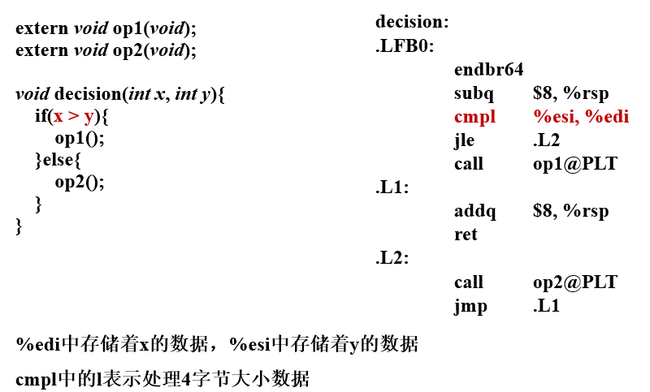

* 除了直接读取条件码，还存在三种可以利用条件码的方式
    * 依据条件码的结合将一个字节的位设为0或1，下图所示的`SET`指令类，该指令的目标可以是寄存器也可以是内存地址，**但是仅仅设置低位的一个字节**
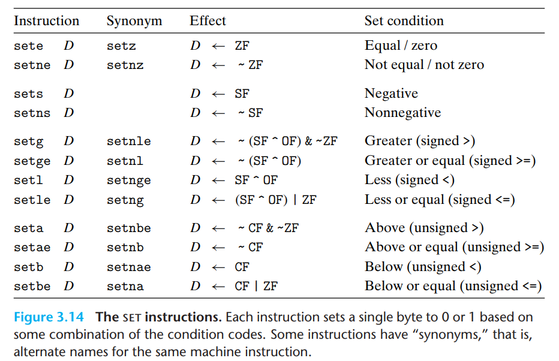

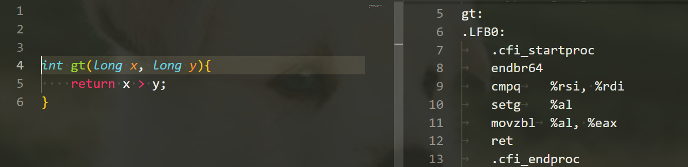
    * 条件的跳转至其它程序部分

跳转指令分为无条件跳转和有条件跳转。

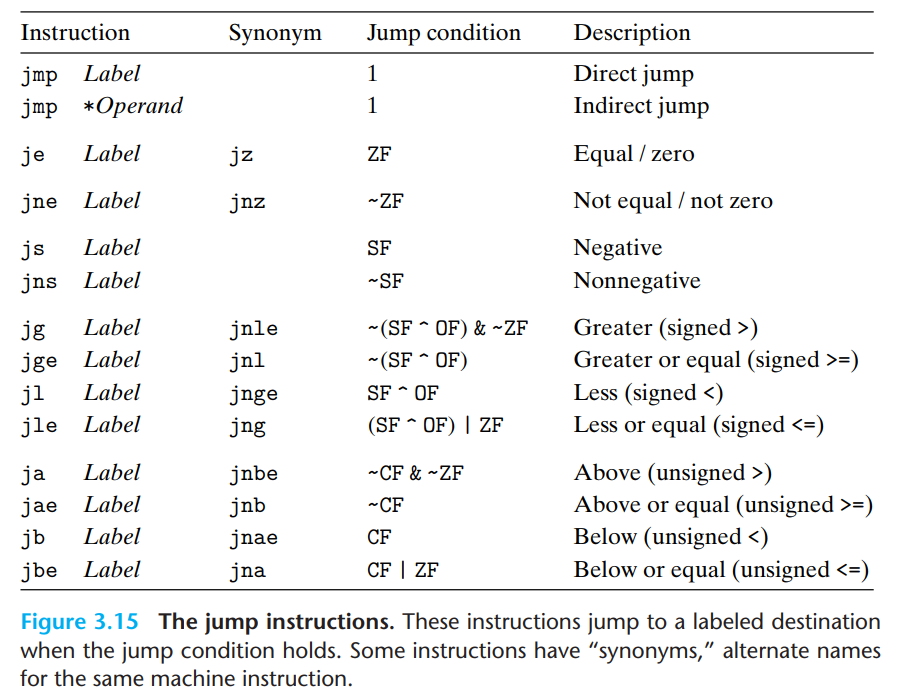

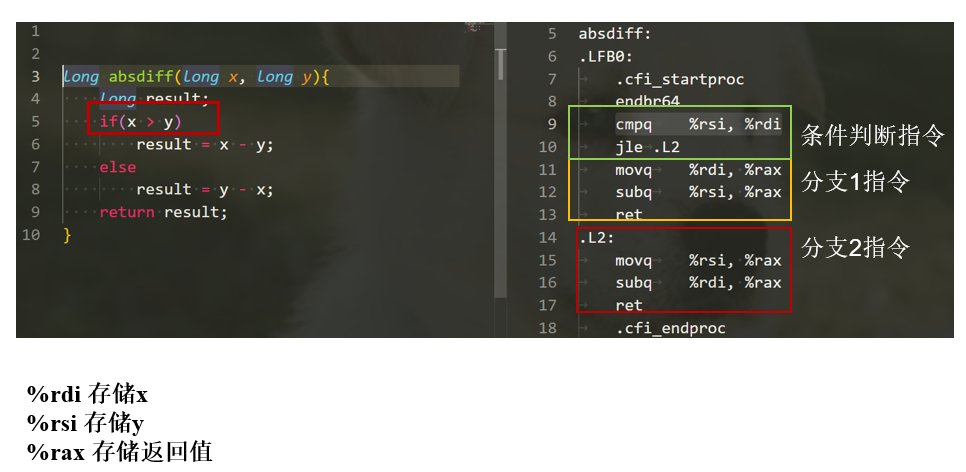

跳转指令编码，汇编代码中跳转目标是使用符号标签表示。当后续的编译器和链接器处理后，会将符号标签转换为实际的二进制地址。如何编码跳转目标，存在两种
方式。一种是**PC 相关的编码**，即目标指令地址和当前下一条指令地址的差值，这些偏移量可以编码为1，2，4bytes。第二种为**绝对编码**，直接使用4个字节
编码目标指令地址。

    * 条件的传输数据(Conditional Moves)

充分利用计算能力，分别同时计算不同分支的结果，当判断条件确定时将目标分支的计算结果移动至返回值。
下图采用`O1`优化模式。

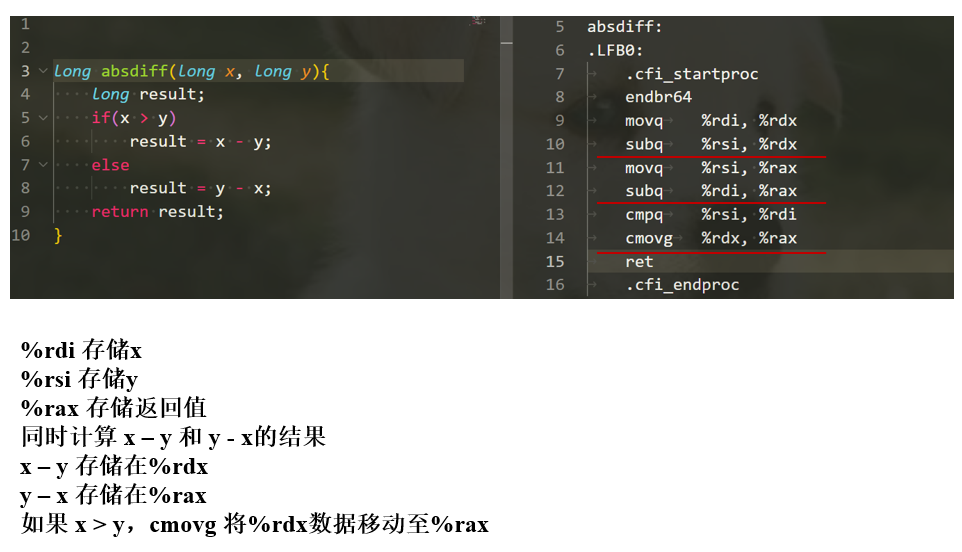

当然条件移动指令也可能存在副作用，如果不同分支存在相互干扰或不安全行为可能会影响计算结果


## 循环（Loop）

#### do-while 循环方式

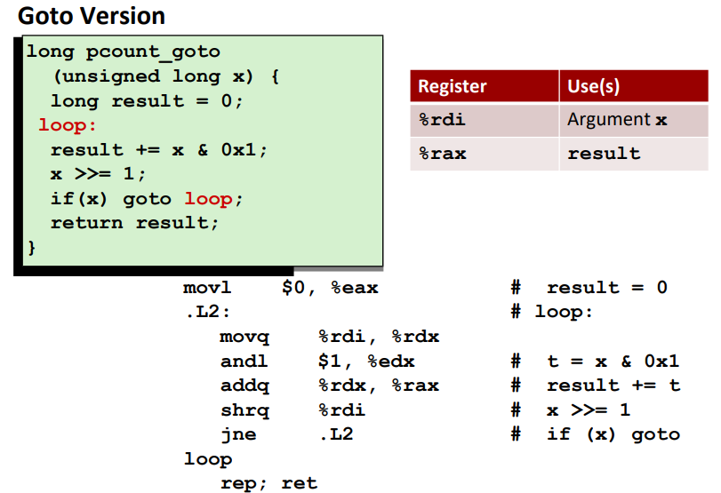


#### while 循环方式

当使用`-Og`模式时，while循环变为汇编代码时，会首先进行初始化过程，然后跳转至测试代码部分，最后依据测试结果判断是否进入循环体。

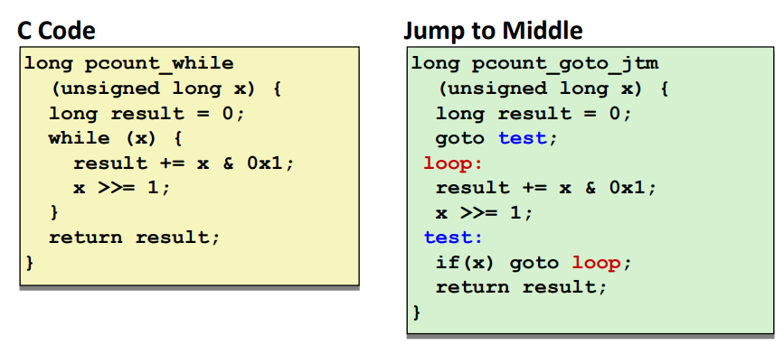

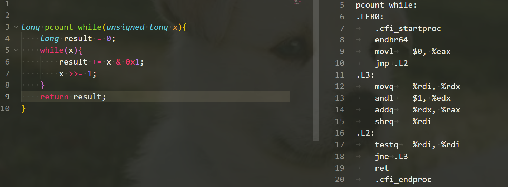

当使用`-O1`优化模式时，会先将while循环转变为do-while循环，再翻译成汇编代码。

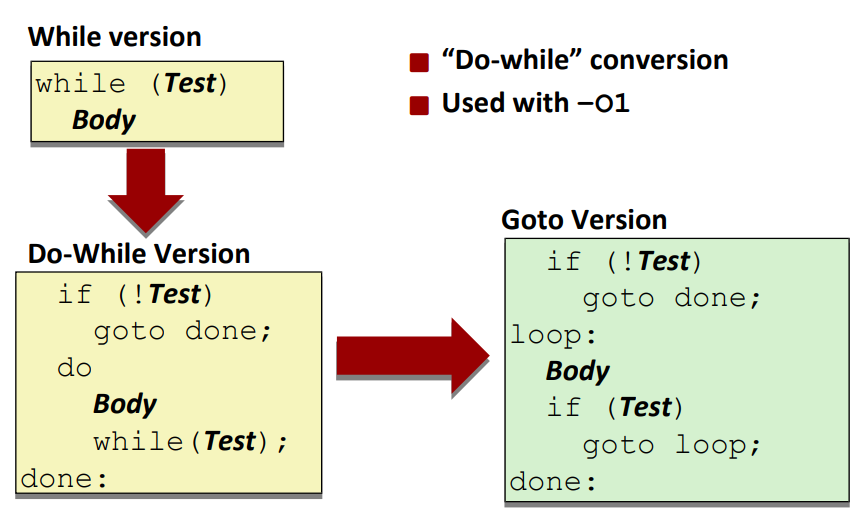

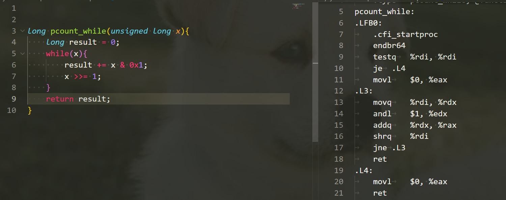

#### for 循环方式

为什么初始测试可以被优化掉？一个原因是代码编写者应该确保初始条件可以进入循环，否则该代码没有任务意义。其次，如果初始测试条件不满足，可以在编译器阶段进行优化代码。
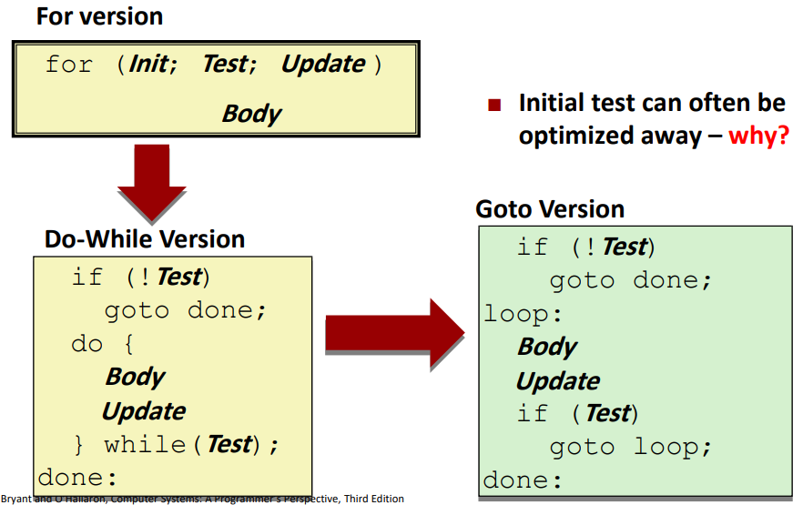

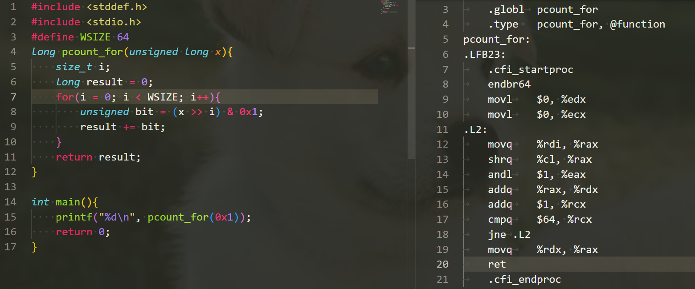


## switch 语句


# 机器视角的程序（Procedures）

程序是一种软件抽象，用于打包实现特定功能的代码片段。程序调用涉及多个方面的机制：

* 传递控制权，程序计数器需要设置为被调用函数的起始位置
* 传递数据，调用函数需要将参数数据传递给被调用函数使用
* 分配和释放内存空间

## Run-time Stack

栈是一种先进后出的数据结构，十分适合用于函数调用的内存管理。

## 控制权转移

当函数P内部调用函数Q时，需要将程序计数器设置为函数Q的起始地址，但是为了函数Q执行完毕可以正确返回函数P中指定地址，需要将返回地址进行记录。
在x86-64机器中，利用指令`call Q`完成上述功能。

| Instruction | Description
| ----- | -----
| call Label | 将当前指令的下一条指令地址推入栈中，并将PC设为Label地址
| call *Operand | 将当前指令的下一条指令地址推入栈中，并将PC设为操作数所指定的地址
| ret | 将栈上的地址弹出记为A，并将PC设为地址A

```bash
call 指令的动作：
1. 寄存器%rsp减去8个字节（这8个字节用于存储函数执行完毕返回的地址）
2. 寄存器%rip设置为被调用函数的起始地址

ret 指令的动作：
1. 弹出寄存器%rsp所指向内存地址的8个字节(地址A)
2. 将寄存器%rsp = %rsp + 0x8
3. 将寄存器%rip设为地址A
```


## 数据转移

x86-64结构下函数参数传递大部分通过寄存器实现，寄存器传递参数存在约定俗成的做法：

* x86-64下至多可以通过寄存器传递6个整数参数(包括指针)，使用顺序（**从左往右**）如下图所示：

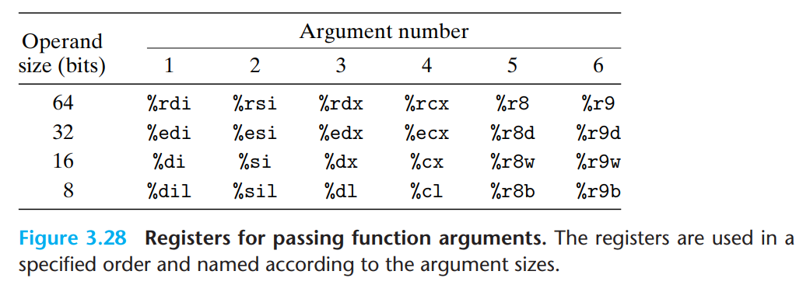

* 当函数参数超过6个，剩余参数通过栈进行传递，入栈的顺序为**从右往左**

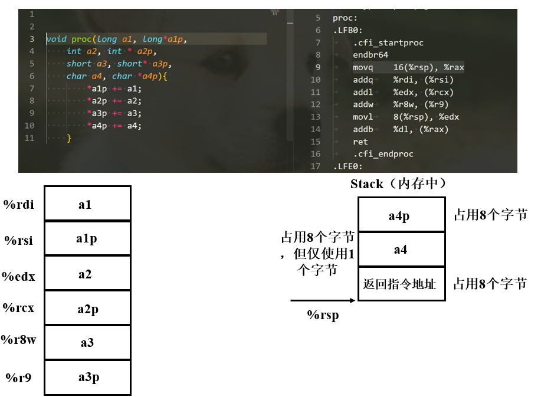

## 栈上数据的局部存储

* 没有足够的寄存器保存所有局部数据
* 取地址运算符用于某个局部变量
* 一些局部变量是数组或结构体

函数的局部变量以相反的顺序存储在栈上？


## 寄存器上的局部变量

所有程序都共享相同的寄存器，当函数不断调用，被调用函数可能覆盖寄存器的值，这导致之前的函数在之后无法访问原始的数据。为了保证局部变量在寄存器上的
安全使用，x86-64采用了相同的惯例让所有程序调用都遵循。


