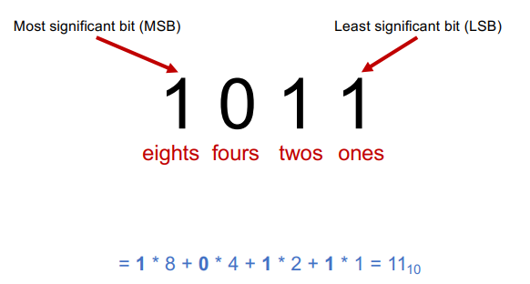
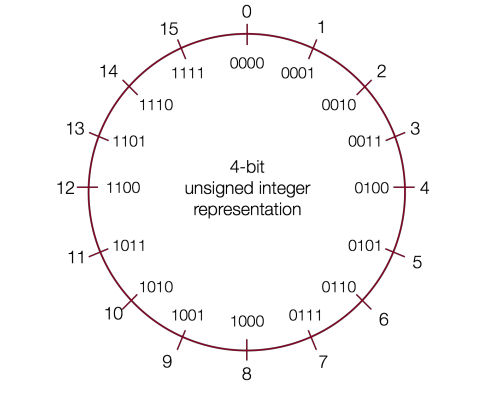
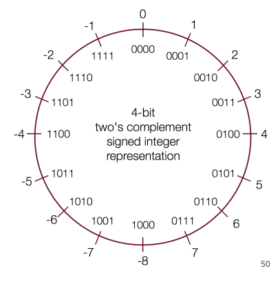
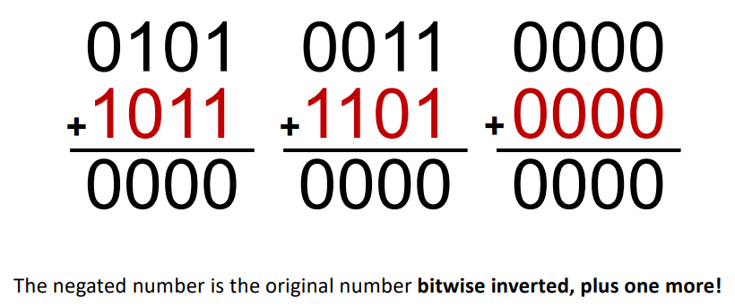
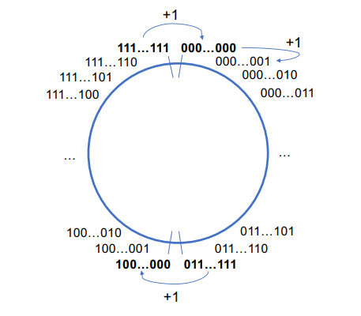
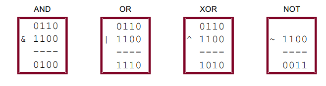
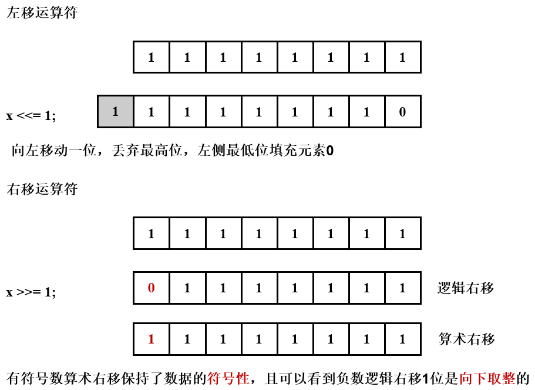
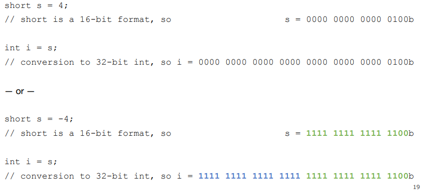
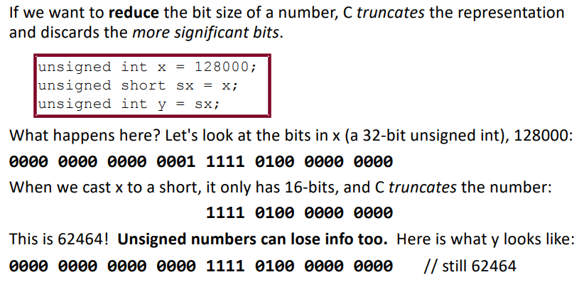

# 数据的表示

## 二进制的表示



## 无符号整数（Unsigned）

如果一个数据表示的位数为$w$，则可以表示的无符号数据大小范围是$[0, 2^w - 1]$。下图展示了一个4位比特所能表示的数据范围：



## 有符号整数（signed）

有符号数据可以表示正数、负数以及0，比特位的最高位表示符号位，若为1则表示负数，若为0则表示非负数。其表示如下图所示：



**为什么负数的表示形式是这样的？**

首先我们需要知道， $-8 + 8 = 0$ 是大家认可的。大家可以观察下图，可以看到负数的二进制表示是其对应正数的二进制位**取反**，再**加1**获得。我们也称有符号数据的表示为**补码**。




## 数据溢出（overflow）

如果数据超出比特位所能表示的最大值，则会溢出变为所能表示的最小值。



* example

```c
#include <stdio.h>
#include <limits.h>

int main(){
    // 观察不同数据类型的溢出后的表现
    unsigned int a1 = 0xffffffff;
    int a2 = 0x7fffffff;
    int a3 = 0x80000000;
    // limits.h
    printf("signed int表示最大数值为: %d\n", INT_MAX);
    printf("signed int表示最小数值为: %d\n", INT_MIN);
    printf("unsigned int overflow: %d\n", a1 + 1); // 0
    printf("signed int overflow: %d\n", a2 + 1); // INT_MIN
    printf("int underflow: %d\n", a3 - 1); // INT_MAX

    unsigned short s1 = 0xffff;
    short s2 = 0x7fff;
    short s3 = 0x8000;
    printf("short 表示最大数值为: %hd\n", SHRT_MAX);
    printf("short 表示最小数值为: %hd\n", SHRT_MIN);
    printf("unsigned short overflow: %hu\n", s1 + 1); // 0
    printf("short overflow: %hd\n", s2 + 1); // SHRT_MIN
    printf("short underflow: %hd\n",s3 - 1); // SHRT_MAX

    unsigned char c1 = 0xff;
    char c2 = 0x7f;
    char c3 = 0x80;
    printf("char 表示最大数值为: %hhd\n", SCHAR_MAX);
    printf("char 表示最小数值为: %hhd\n", SCHAR_MIN);
    printf("unsigned char overflow: %hhu\n", c1 + 1); // 0
    printf("char overflow: %hhd\n", c2 + 1); // -128
    printf("char underflow: %hhd\n", c3 - 1); // 127

    return 0;
}
/*
signed int表示最大数值为: 2147483647
signed int表示最小数值为: -2147483648
unsigned int overflow: 0
signed int overflow: -2147483648
int underflow: 2147483647
short 表示最大数值为: 32767
short 表示最小数值为: -32768
unsigned short overflow: 0
short overflow: -32768
short underflow: 32767
char 表示最大数值为: 127
char 表示最小数值为: -128
unsigned char overflow: 0
char overflow: -128
char underflow: 127
*/
```

## 位操作

#### 与、或、异或、取反位操作



#### 移位操作

* 左移操作，右侧比特位填充0
* 右移操作
  * 逻辑右移，左侧高位填充0
  * 算术右移，左侧高位填充符号位



## 数据类型的隐式转换

* C语言中针对同一数据类型的无符号数和有符号数进行大小比较时，会**隐式转换为无符号数进行比较**

* 从小数据类型转换为大数据类型
  * unsigned类型添加前导0
  * signed类型添加符号位，符号位为1则添加前导1，符号位为0则添加前导0

* example

```C
#include <stdio.h>

int main(int argc, char* argv[]){
    short s1 = 4;
    short s2 = -4;

    int i1 = s1;
    int i2 = s2;

    printf("%d\n", i1);
    printf("%d\n", i2);

    return 0;
}
```



* 从大数据类型裁剪(truncate)为小数据类型，**抛弃**超出的高比特位




* example

```C
#include <stdio.h>

int main(int argc, char* argv[]){
    int x = 53191;
    short sx = x;
    int y = sx;

    // x(4 bytes) binary 0000 0000 0000 0000 1100 1111 1100 0111
    printf("x = %d\n", x); // 53191
    // sx(2 bytes) binary 1100 1111 1100 0111
    printf("sx = %hd\n", sx); // -12345
    // 符号位扩展，前导元素为 1
    // y(4 bytes) binary 1111 1111 1111 1111 1100 1111 1100 0111
    printf("y = %d\n", y); // -12345

    return 0;
}
```