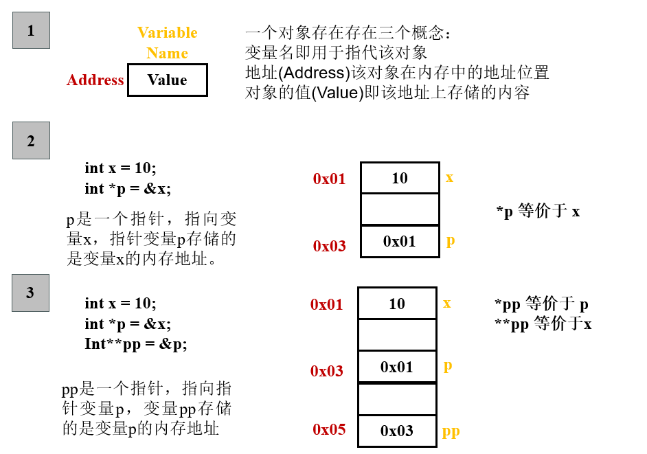
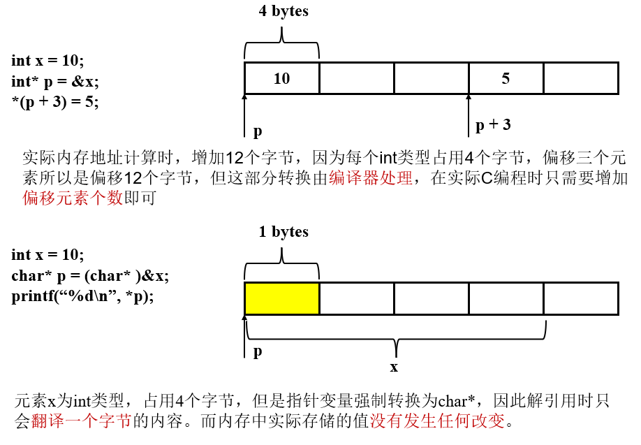

# 指针(Pointers)

指针的概念是C编程语言的核心特征，它提供了一种**统一**的方式引用不同类型的数据结构。

## 指针的一些原则

* 每个指针都有关联的数据类型

```C
int* p1; // 指针 p1 指向的是一个int类型
int** p2; // 指针 p2 指向的是一个 int* 类型
```



* `void *` 是C语言中的泛型指针，不包含任何类型信息，使用前需要手动类型转换

* 指针通过取地址运算符`&`实现

* 指针通过`*`运算符解引用

* 数组名和指针可以等价替换

```C
// *(arr + 1) 等价于 arr[1]
int arr[5];
int* p;
```

* 强制类型转换指针类型不会改变内存中实际存储的值，只会改变**地址计算的缩放因子**以及**解引用的字节大小**



* 指针也可以指向函数，函数指针的值是第一条指令的内存地址，在C编程中函数名就是函数的地址

```C
int add(int x, int y);

int (*fp)(int, int); // 函数指针
// int* fp(int, int); 就不是一个函数指针，*会优先和int结合，表示一个函数原型
fp = add;
fp(1, 2);
```

## 泛型指针

考虑一个实际问题，我们希望在一个数组中找出最大值，该数组可以是`int`类型数组、`double`类型数组以及`char*`数组。

#### 初步的解决方式

* 为每一个类型编写一个寻找最大值的函数
* 分别调用相应的函数实现最大值寻找

```C
#include <stdio.h>
#include <string.h>

int find_int_max(int arr[], size_t n){
    int max = arr[0];
    for(int i = 1; i < n; i++){
        if(arr[i] > max)
            max = arr[i];
    }
    return max;
}

double find_double_max(double arr[], size_t n){
    double max = arr[0];
    for(int i = 1; i < n; i++){
        if(arr[i] > max)
            max = arr[i];
    }
    return max;
}

char* find_string_max(char* arr[], size_t n){
    char* max = arr[0];
    for(int i = 1; i < n; i++){
        if(strcmp(arr[i], max) > 0)
            max = arr[i];
    }
    return max;
}

int main(){
    int arr1[] = {1, 10, 5, 4, 6};
    double arr2[] = {2.2, 4.3, -5.3, 9.8, 18.8};
    char* arr3[] = {"apple", "green", "blue", "red", "yellow"};

    int max_int = find_int_max(arr1, sizeof(arr1) / sizeof(arr1[0]));
    printf("Int max is %d\n", max_int);

    double max_double = find_double_max(arr2, sizeof(arr2) / sizeof(arr2[0]));
    printf("Double max is %f\n", max_double);

    char* max_string = find_string_max(arr3, sizeof(arr3) / sizeof(arr3[0]));
    printf("String max is %s\n", max_string);

    return 0;
}
```

* 输出内容如下：

```
Int max is 10
Double max is 18.800000
String max is yellow
```

#### 利用泛型指针`void *`解决代码冗余

* `void *` 指针可以接收任意类型的指针
* `void *` 指针不包含任何类型信息，无法进行指针运算
* `char * p` 指针`p+1`表示内存地址增加一个字节 

```C
#include <stdio.h>
#include <string.h>

void* gfind_max(void* arr, size_t elemSize, size_t n, int (*cmpFunc)(const void*, const void*)){
    void* max = arr;
    for(int i = 1; i < n; i++){
        // 利用 char* 可以进行逐字节移动内存地址
        // void* 无法进行指针运算 
        if(cmpFunc((char*)arr + i * elemSize, max) > 0)
            max = (char*)arr + i * elemSize;
    }
    return max;
}

int cmp_int(const void* p1, const void* p2){
    int a = *(int*)(p1);
    int b = *(int*)(p2);
    if(a > b) return 1;
    else if (a < b) return -1;
    else return 0;
}

int cmp_double(const void* p1, const void* p2){
    double a = *(double*)p1;
    double b = *(double*)p2;
    if(a > b) return 1;
    else if(a < b) return -1;
    else return 0;
}

int cmp_string(const void* p1, const void* p2){
    char* a = *(char**)p1;
    char* b = *(char**)p2;
    return strcmp(a, b);
}

int main(){
    int arr1[] = {1, 10, 5, 4, 6};
    double arr2[] = {2.2, 4.3, -5.3, 9.8, 18.8};
    char* arr3[] = {"apple", "green", "blue", "red", "yellow"};

    int max_int = *(int *)gfind_max(arr1, sizeof(int), sizeof(arr1) / sizeof(arr1[0]), cmp_int);
    printf("Int max is %d\n", max_int);

    double max_double = *(double *)gfind_max(arr2, sizeof(double), sizeof(arr2) / sizeof(arr2[0]), cmp_double);
    printf("Double max is %f\n", max_double);

    char* max_string = *(char**)gfind_max(arr3, sizeof(char*), sizeof(arr3) / sizeof(arr3[0]), cmp_string);
    printf("String max is %s\n", max_string);

    return 0;
}
```

* 输出结果

```
Int max is 10
Double max is 18.800000
String max is yellow
```