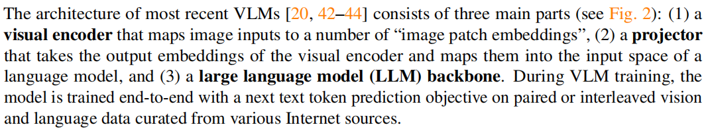
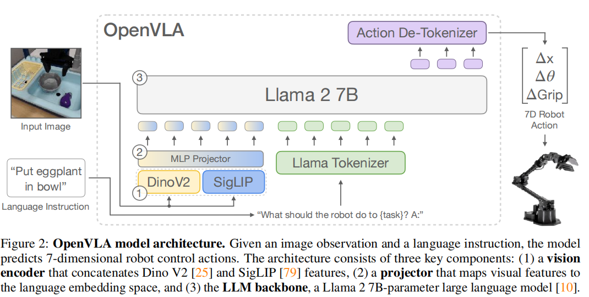
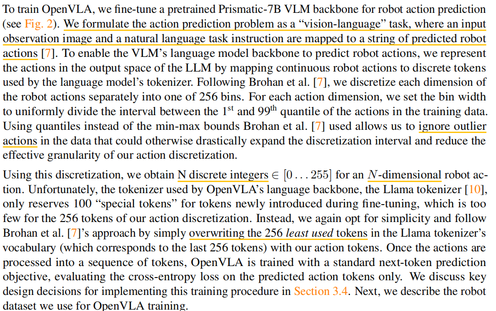
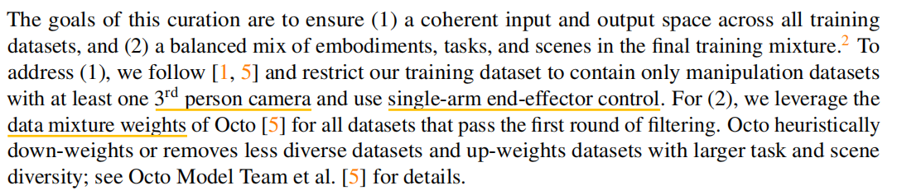
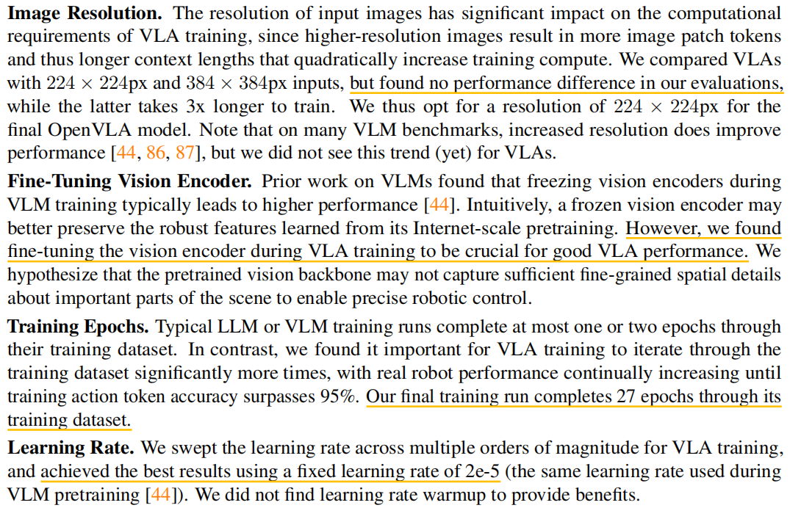
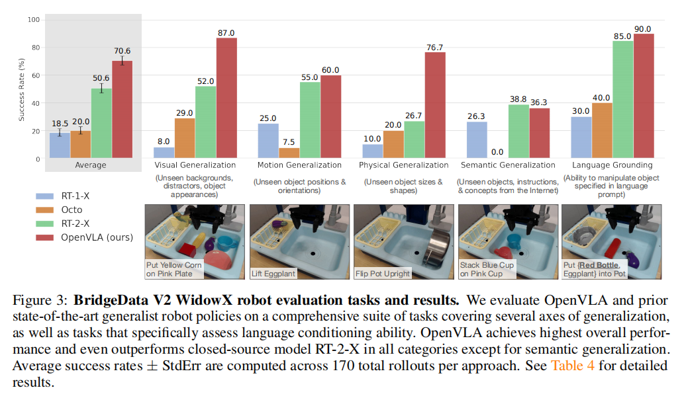

# 摘要

## 现存的挑战

* 现有的工作大多是闭源的，无法获取其代码训练细节
* 现有的工作没有探索VLA（Vision-Language-Action）在新任务上的高效微调（==该性质对于应用端十分重要==）

# 引言

作者认为现有机器学习的操纵策略存在一个**关键**弱点，即它们无法或者是很难泛化到训练集中未见的场景和事件。然而，现有的视觉语言基础模型更够在未见

领域泛化更多（**得益于互联网规模尺度的训练数据集**）。目前数据集的规模最大的也仅有100K - 1M样本，很难复制大语言模型训练的缩放效应。为此，利用

现有视觉-语言基础模型作为核心构建模块训练机器人策略，可能可以使得泛化到超出训练数据的目标、场景以及任务等。

为了实现上述目标，现有工作探索了如下内容：

* 将视觉语言模型作为机器的表征学习
* 用于任务规划和执行中的一个组件
* 直接使用预训练视觉语言模型微调输出控制指令（VLA，Vision-Language-Action)

    * 代表工作RT-2

本文作者引入了OpenVLA，一个开源的7B参数量模型。OpenVLA由一个预训练的视觉语言模型在多个细粒度上捕捉视觉特征，并在一个970K机器人数据集上

微调（Open-XEmbodiment dataset）

# 方法

## Vision-Langage Model

* 视觉编码器将图像输入映射为一系列`Image Patch Embedding`
* 投影层（Projector）将视觉编码器输出的embedding 映射到语言模型的 embedding 空间
* 语言模型的骨干网络(LLM Backbone)

本文作者采用了 Prismatic-7B VLM 作为基础模型，该模型的视觉编码器部分由两个预训练视觉模型组成，分别是**SigLIP**和**DinoV2**。输入图像的`Patches`同时送入两个视觉编码器，得到的特征在**通道方向**上进行拼接。额外加入**DinoV2**模型是为了提高模型的空间推理能力，这被认为对于机器控制是有益的(来自其它论文的参考)。

Prismatic-7B VLM 使用 LLaVA 1.5数据混合策略进行微调，大约包含1M image-text和 text-only数据。

## OpenVLA Training Procedure

我们将动作预测问题构建为视觉-语言任务，该任务将输入观察图像和自然语言指令**映射**为一系列机器人动作。为了语言模型网络可以预测机器人动作，我们**通过语言模型的tokenizer**将连续的机器人动作转换为**离散的tokens**。

## Training Data

本文采用数据集[Open X-Embodiment dataset](https://arxiv.org/pdf/2310.08864)，针对原始数据集做如下处理步骤：

目的：

* 确保跨数据集的输入/输出空间的连续性
* 确保最终训练混合物中实施例、任务以及场景的平衡

## OpenVLA Design Decisions

#### VLM Backbone

作者实验了 LLaVA 和  IDEFICS-1 作为骨干网络，但是都不如 Prismatic。作者认为这是由于 SigLIP-DinoV2 backbones 提供了更好的**空间推理能力**。

## Experiments

* visual (unseen backgrounds, distractor objects, colors/appearances of objects); 
* motion (unseen object positions/orientations); 
* physical (unseen object sizes/shapes);
* semantic (unseen target objects, instructions, and concepts from the Internet);
* language conditioning ability in scenes with multiple objects;
