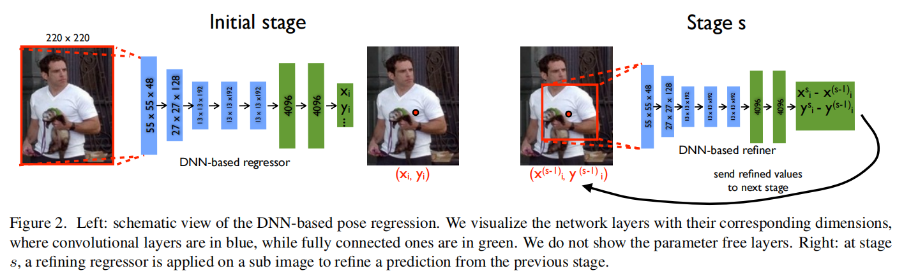

# **Deeppose: Human pose estimation via deep neural networks**
该论文是早期利用深度学习网络进行人体姿态估计的工作之一，将人体姿态估计构建为基于深度神经网络**回归**人体姿态参数的过程。该方案利用DNN实现输入图像到人体姿态参数的映射过程。该过程存在两个优势：1.每个关机回归器利用全图作为输入信号，具有更好的上下文信息。2.相比于基于图形模型的方法，不再需要部件级的检测器以及探索各关节间的关系，简化了算法流程。
## 方法
首先，将身体关节编码为$k$个关节点坐标向量，表示为$y = (\cdots, y_i^T, \cdots)^T, i \in \{1, \cdots, k\}$，其中$y_i$表示第$i$个关节的坐标位置。同时利用Bounding Box来归一化姿态坐标参数，$b = (b_c, b_w, b_h)$表示框的位置参数，$b_c$表示Bounding Box的中心坐标。因此，关节$y_i$可以表示成如下过程：
$$N(N_I, b) = 
\begin{pmatrix}
    \dfrac{1}{b_w} & 0 \\
    0 & \dfrac{1}{b_h}
\end{pmatrix}
(y_i - b_c)
$$
因此，姿态估计可以构建为回归问题，希望训练获得一个函数$\psi(x; \theta) \in R^{2k}$，实现从图像$x$到归一化姿态特征向量的映射，$\theta$表示训练的模型参数。最后，可以获得关节坐标的绝对值，如下所示：
$$y^{*} = N^{-1}(\psi(N(x); \theta))$$
整体算法框架如下：损失函数为$L_2$损失函数。为了提高模型对于细节的捕捉能力，提出了级联的姿态回归器。后一阶段的回归器用于预测初始姿态预测与真值的偏移量，实现坐标精度的调优功能。由于后续回归器作用于初始预测关节的子图，具有更高的分辨率
