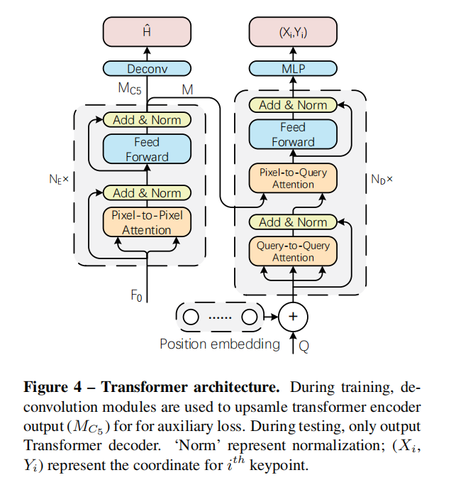

# **TFPose: Direct Human Pose Estimation with Transformers**
作者将姿态估计构建为**序列预测问题**，框架简单直接，可以缓解基于**Heatmap**方法存在的问题。同时利用Transformer中的注意力机制可以自适应的关注与关节相关的特征，避免了基于回归方法中特征不对齐的问题。
## 引言
作者认为目前姿态估计主要分为两大类方法：heatmap-based和regression_based。其中基于热图的方法存在以下几个缺陷：
1. 需要后处理操作，且后处理可能不可微，无法实现端到端的训练
2. 热图的分辨率通常明显小于原图，对于关节点定位存在精度和量化误差
3. 热图的真值需要人工手动设计和调整，会引入噪声和误差
然而目前基于回归的方法在性能上并不是最优的，作者认为主要存在以下几个原因：
1. 为了平衡网络参数量，使用**全局池化操作**来改变空间特征图大小
2. 卷积特征和预测是不对齐的（这里不对齐指代什么？），造成坐标的精度不高
3. 仅仅回归关节点的坐标参数，并未考虑关节之间的结构化关系
## 方法

首先利用行人检测器获取对应的裁剪图片，然后利用CNN网络提取多尺度的特征，将多尺度特征添加位置编码送入Transformer Encoder进行特征融合（参照Deformable DETR），最后利用Query矩阵和Transformer Decoder实现姿态参数的预测。

