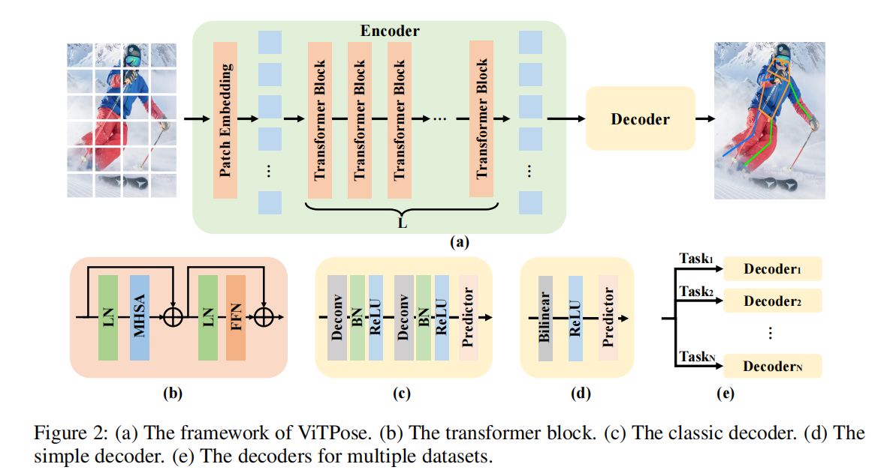

# **ViTPose: Simple Vision Transformer Baselines for Human Pose Estimation**
作者将ViT模型迁移至姿态估计任务，ViT模型结构简单、模型尺寸可缩放性以及训练范式的灵活性。

## 引言
人体姿态估计由于遮挡、裁剪、尺度不一以及不同的外观导致该任务存在很多挑战。现有工作大多利用CNN作为骨干网络提取特征，并加以特殊设计的Transformer结构。于是，作者提出能否利用简单的ViT模型直接进行姿态估计。作者利用MAE预训练的ViT作为基础特征提取器，然后利用一个轻量级的decoder处理获取的特征。

## 方法
