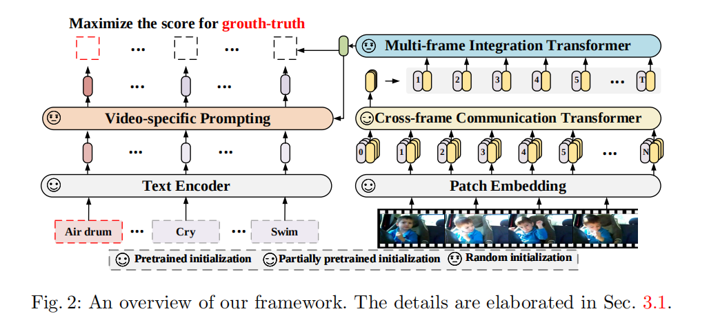
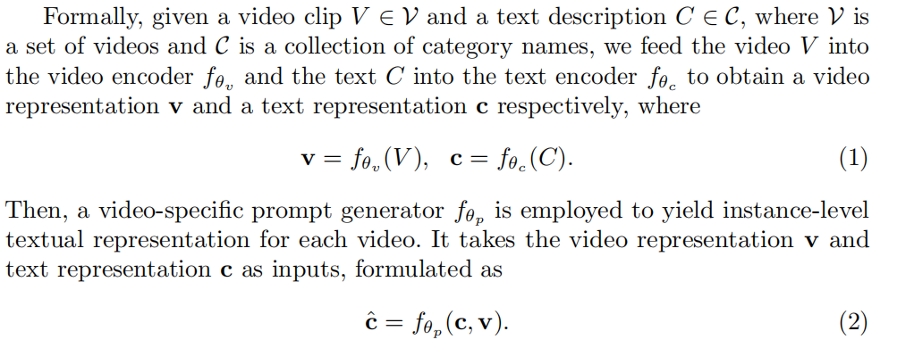
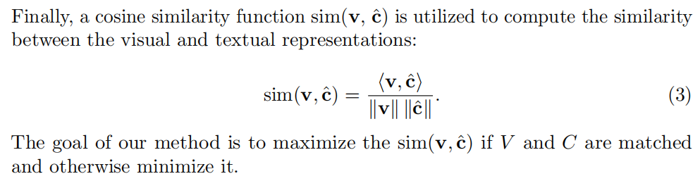
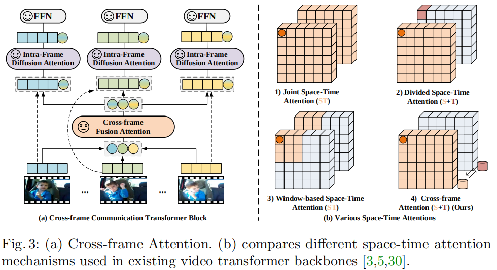
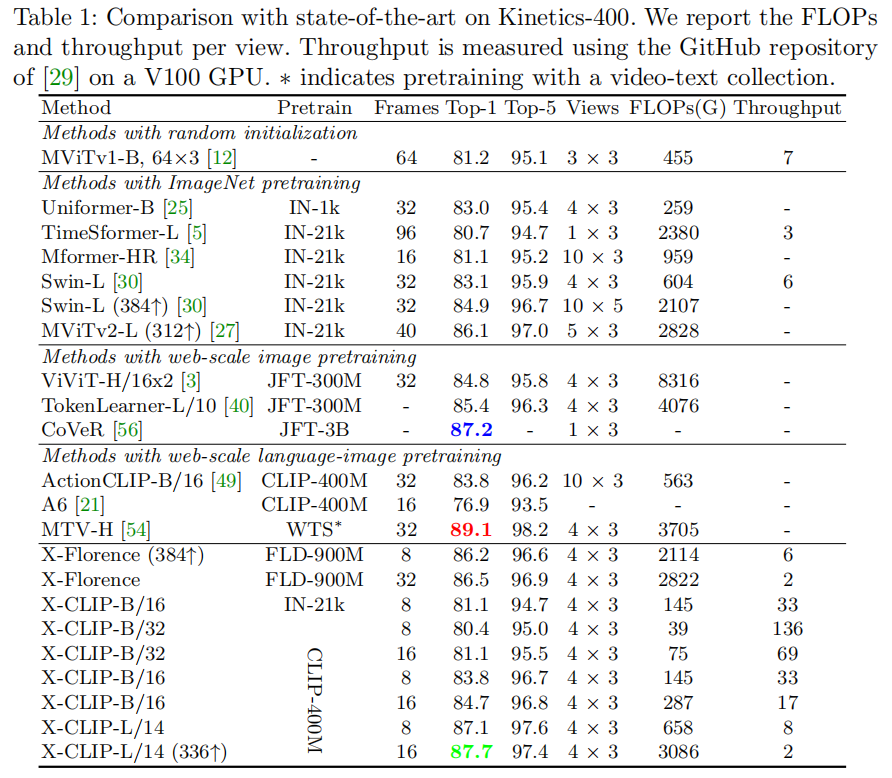
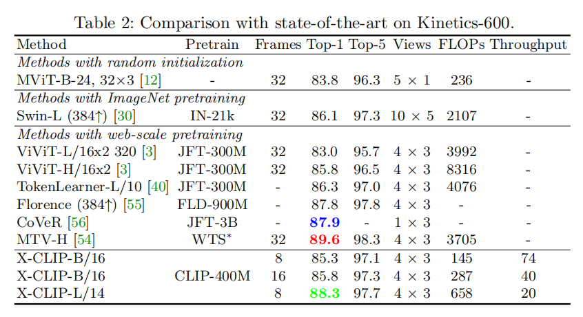
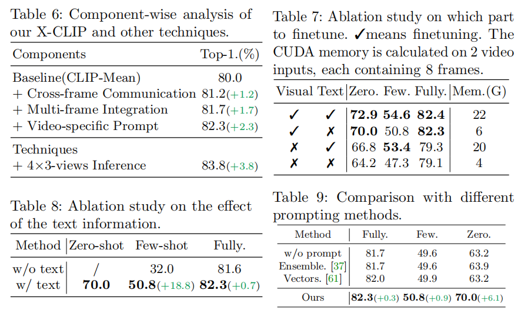

# EVL算法论文阅读
**论文名称**：**Expanding Language-Image Pretrained Models for General Video Recognition**
**代码仓库**：[论文官方GitHub仓库](https://github.com/microsoft/VideoX/)

### Abstract
1. 作者将预训练的**视觉-语言**模型应用视频动作识别进行探索；
2. 提出了跨帧注意力(Cross Frame Attention)机制显示的交换不同帧之间的信息；
3. 提出了视频相关的提示方案，利用视频内容信息产生**判别性**的文本提示(Prompts)。

### Introduction
1. 受到大尺度图像-语言预训练工作(CLIP、ALIGN等)的启发，作者提出利用文本作为监督信号，学习一个更加泛化的视频动作识别(涵盖zero-shot、few-shot、fully-supervised)；
2. 考虑到直接训练**video-language**模型是资源消耗的，为此本文探索了适配**image-language**模型到视频动作识别领域；

**面临的问题**
1. 如何利用蕴含在视频时间维度上的信息；
2. 如何获取视频的判别性文本表征；

**解决方案**
1. 提出新的结构建模视频时间维度
    - Cross Frame Communication Transformer
    - Multi-Frame Integration Transformer
2. 提出可学习的提示机制，同时利用语义标签和视频内容

### Approach
**整体框架图**

**基本流程表示**


**Video Encoder**

采样获得的视频片段表示为$V \in R^{T \times H \times W \times 3}$，$T$表示采样的帧数。每一帧图像按照**ViT**的方式进行预处理，第t帧图像划分为不重叠的图像patches $\{x_{t,i}\}_{i = 1}^{N} \in  R ^{P^2 \times 3}$，然后使用线性矩阵$E \in R^{3P^2 \times D}$将patches转换为**patch embedding**。在序列的头部附加一个可学习的embedding，称为Class Token。$z_t^{(0)}$表示跨帧注意力Transformer的原始输入数据，t表示第t帧图像，$e^{spa}$表示空间位置编码。
$$z_t^{(0)} = [x_{class}, Ex_{t,1}, Ex_{t,2}, \cdots, Ex_{t, N}] + e^{spa}$$

然后将patch embedding送入$L_c$层跨帧通信Transformer(Cross-frame Communication Transformer, CCT)模块，得到帧级别的特征表达$h_t$。
$$z_t^{l} = CCT^{l}(z_t^{l - 1}), l = 1, \cdots, L_c$$
$$h_t = z_{t, 0}^{(L_c)}$$
其中，$l$表示CCT模块的层索引，$z_{t, 0}^{L_c}$表示最后一层输出的**Class Token**。最后，将所有帧级别的特征$H = [h_1, h_2, \cdots, h_T]$送入$L_m$层多帧聚合Transformer(Multi-frame Integration Transformer, MIT)得到视频级特征$v$。
$$v = AvgPool(MIT(H + e^{temp}))$$
其中，AvgPool表示平均池化，$e^{temp}$表示时间位置编码。
**Cross Frame Attention**

为了在不同帧之间进行**信息**交换，作者提出了两种形式的注意力机制：cross-frame fusion attention (CFA)和intra-frame diffusion attention (IFA)。同时引入**message token**，用于抽象发送接收信息的这一过程，其过程如下图所示。

CFA表示利用**message token**学习全局的时空依赖关系，其数学表达式如下：
$$\hat{M}^{(l)} = M^{(l)} + CFA(LN(M^{(l)}))$$
其中$\hat{M}^{(l)} = [\hat{m}_{1}^{(l)}, \hat{m}_{2}^{(l)}, \cdots, \hat{m}_{T}^{(l)}]$表示每一帧图像在每一层获得的**message token**。IFA则表示帧内扩散过程，将全局的信息通过**message token**传递到每一帧内部的学习过程。
$$[\hat{z}_t^l, \bar{m}_t^l] = [\hat{z}_t^{l - 1}, \hat{m}_t^l] + IFA(LN([\hat{z}_t^{l - 1}, \hat{m}_t^l]))$$
其中，$[\cdot, \cdot]$表示拼接Frame tokens和Message token。最后丢弃Message token，将更新的帧tokens送入FFN层。
$$z_t^{l} = \hat{z}_t^{(l)} + FFN(LN(\hat{z}_t^{(l)}))$$

**参数初始化**

IFA模块参数利用预训练权重进行初始化，CFA模块则是随机初始化。
**Text Encoder**

对于视频描述$C$可以通过文本编码器获得文本表征$c = f_{\theta_c}(C)$，不像以往使用人工设计的提示词来强化文本描述，本文作者提出利用原始的文本描述$C$和**可学习**的文本提示方案。对于视频表征$\bar{z}$和文本表征$c$作为输入，进行自注意力建模提取与文本信息相关的视觉线索。
$$\bar{c} = c + MSHA(c, \bar{z})$$
$$\tilde{c} = \bar{c} + FFN(\bar{c})$$
其中，$\bar{z} \in R^{N \times d}$表示沿着时间维度平均$\{z_t^{(L_c)}\}_{t = 1}^T$，$\tilde{c}$表示视频相关的提示内容。$c$作为自注意力的Query，$\bar{z}$作为Key和Value。增强的文本特征为$\hat{c} = c + \alpha \tilde{c}$，$\alpha$为可学习的加权参数。

### Experiments
**性能比较**




### 内容说明
本文内容主要是个人对于原始论文的理解，图片、数据等皆引用于原始论文，如有错误和意见，欢迎大家给出反馈，联系邮箱`22160576@zju.edu.cn`。
### Bibtex

```bibtex
@InProceedings{XCLIP,
  title={Expanding Language-Image Pretrained Models for General Video Recognition},
  author={Ni, Bolin and Peng, Houwen and Chen, Minghao and Zhang, Songyang and Meng, Gaofeng and Fu, Jianlong and Xiang, Shiming and Ling, Haibin},
  booktitle={European Conference on Computer Vision (ECCV)},
  year={2022}
}
```