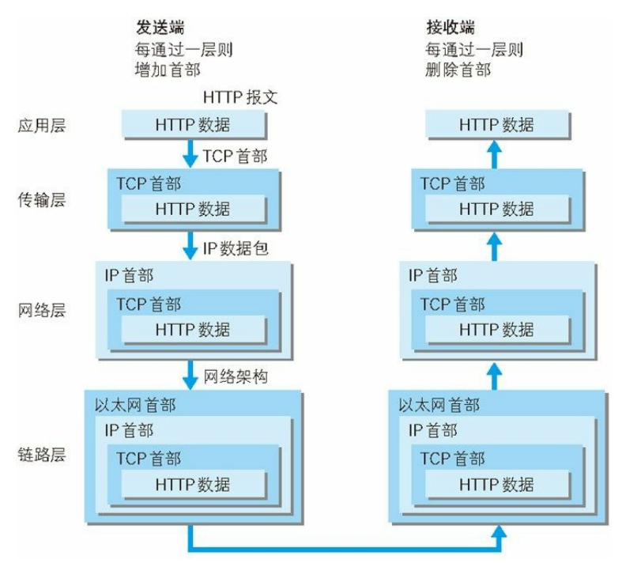
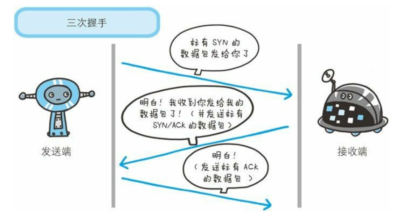

# 图解 HTTP

## 第一章

#### 1.3 网络基础 TCP/IP

计算机与网络设备要相互通信，双方就必须基于相同的方法。比如，如何探测到通信目标、由哪一边先发起通信、使用哪种语言进行通信、怎样结束通信等规则都需要事先确定。不同的硬件、操作系统之间的通信，所有的这一切都需要一种规则。而我们就把这种规则称为协议（protocol）

* TCP/IP 的分层管理
    * 应用层：应用层决定了向用户提供应用服务时通信的活动。TCP/IP 协议族内预存了各类通用的应用服务。比如，**FTP**（File Transfer Protocol，文件传输协议）和 **DNS**（Domain Name System，域名系统）服务就是其中两类。HTTP 协议也处于该层。
    * 传输层：传输层对上层应用层，提供处于网络连接中的两台计算机之间的**数据传输**。在传输层有两个性质不同的协议：TCP（Transmission Control Protocol，传输控制协议）和 UDP（User Data Protocol，用户数据报协议）
    * 网络层：网络层用来处理在网络上流动的数据包。**数据包**是网络传输的最小数据单位。该层规定了通过怎样的路径（所谓的传输路线）到达对方计算机，并把数据包传送给对方。与对方计算机之间通过多台计算机或网络设备进行传输时，网络层所起的作用就是在众多的选项内选择一条传输路线。
    * 数据链路层：用来处理连接网络的**硬件部分**。包括控制操作系统、硬件的设备驱动、NIC（Network Interface Card，网络适配器，即网卡），及光纤等物理可见部分（还包括连接器等一切传输媒介）。硬件上的范畴均在链路层的作用范围之内。
* TCP/IP 通信传输流
    * 我们用 HTTP 举例来说明，首先作为发送端的客户端在应用层（HTTP 协议）发出一个想看某个 Web 页面的 HTTP 请求。
    * 为了传输方便，在传输层（TCP 协议）把从应用层处收到的数据（HTTP 请求报文）进行**分割**，并在各个报文上**打上标记序号及端口号**后转发给网络层。
    * 在网络层（IP 协议），增加作为通信目的地的 MAC 地址后转发给链路层。这样一来，发往网络的通信请求就准备齐全了。
    * 接收端的服务器在链路层接收到数据，按序往上层发送，一直到应用层。当传输到应用层，才能算真正接收到由客户端发送过来的 HTTP请求。

发送端在层与层之间传输数据时，每经过一层时必定会被打上一个该层所属的**首部信息**。反之，接收端在层与层传输数据时，每经过一层
时会把对应的首部消去。这种把数据信息包装起来的做法称为封装（encapsulate）。

#### 1.4 与 HTTP 关系密切的协议 : IP、TCP 和DNS

* 负责传输的 IP 协议

按层次分，IP（Internet Protocol）网际协议位于网络层。IP 协议的作用是把各种数据包传送给对方。而要保证确实传送到对方
那里，则需要满足各类条件。其中两个重要的条件是 IP 地址和 MAC 地址（Media Access Control Address）。IP 地址指明了节点被分配到的地址，MAC 地址是指网卡所属的固定地址。IP 地址可以和 MAC 地址进行配对。IP 地址可变换，但 MAC地址基本上不会更改。

IP 间的通信依赖 MAC 地址。在网络上，通信的双方在同一局域网（LAN）内的情况是很少的，通常是经过多台计算机和网络设备中转
才能连接到对方。而在进行中转时，会利用下一站中转设备的 MAC 地址来搜索下一个中转目标。这时，会采用 ARP 协议（Address Resolution Protocol）。ARP 是一种用以解析地址的协议，根据通信方的 IP 地址就可以反查出对应的 MAC 地址。

* 确保可靠性的 TCP 协议

按层次分，TCP 位于传输层，提供可靠的字节流服务。所谓的字节流服务（Byte Stream Service）是指，为了方便传输，将大
块数据分割成以报文段（segment）为单位的数据包进行管理。而可靠的传输服务是指，能够把数据准确可靠地传给对方。一言以蔽之，TCP 协议为了更容易传送大数据才把数据分割，而且 TCP 协议能够确认数据最终是否送达到对方。

为了准确无误地将数据送达目标处，TCP 协议采用了三次握手（three-way handshaking）策略。用 TCP 协议把数据包送出去后，TCP
不会对传送后的情况置之不理，它一定会向对方确认是否成功送达。握手过程中使用了 TCP 的标志（flag） —— SYN（synchronize） 和
ACK（acknowledgement）。

* 负责域名解析的 DNS 服务

DNS（Domain Name System）服务是和 HTTP 协议一样位于应用层的协议。它提供域名到 IP 地址之间的解析服务。