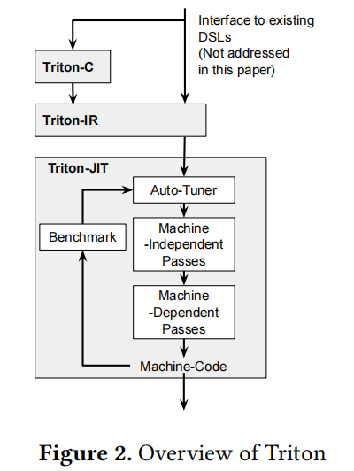
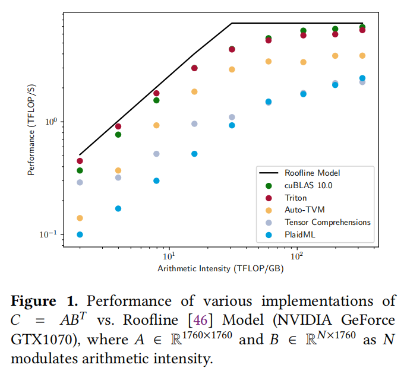
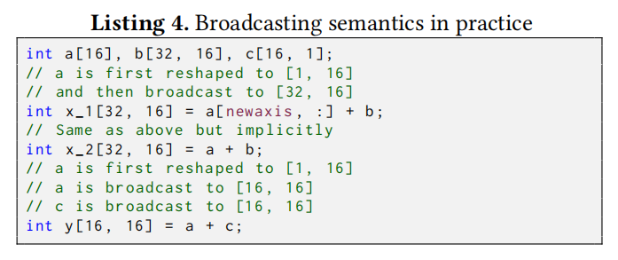
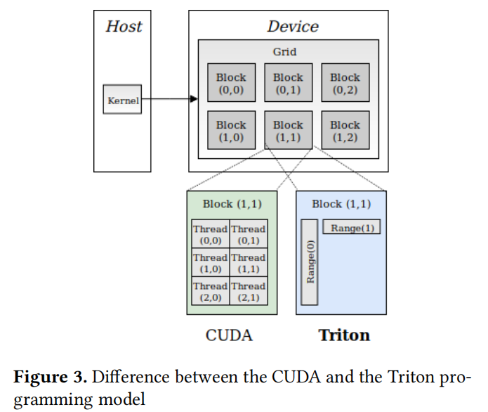

# Triton

## 论文阅读

论文名称：**Triton: An Intermediate Language and Compiler for Tiled Neural Network Computations**

Triton 是以贴片概念为核心的语言和编译器。核心要点如下：

* 基于C语言和基于LLVM的**中间表示**(intermediate representaion, IR)并且根据在参数化的贴片变量的操作来描述/表达tensor程序。

* 一系列 tile-level 的优化策略将程序编译成高效的 GPU 代码

triton 整体架构如下图所示：

本文的贡献点：

* Triron-C 类C风格的编程语言用于表示tensor程序
* Triton-IR 基于LLVM的中间表示，提供了贴片级程序分析、转换和优化的环境
* Triton-JIT 一种及时的编译器和代码生成后端用于将Triton-IR程序转换为高效的 LLVM bitcode。

性能比较示意图：

#### The Triton-C Language

Triton-C 继承和扩展了C语言的语法形式，Numpy-like 的语义以及`Single-Program, Multiple-Data(SPMD)`的编程模型。

##### Syntax

* Tile declarations

利用`int tile[16, 16]` 语法来声明多维数组，而不是原始 C 语言中的递归数组(`int tile[16][16]`)。Tile的shape必须是常量，但也可以是关键字`tunable`声明的参数化变量。一维整数tiles可以用省略号进行初始化，`int range[8] = 0 ... 8`。

* Built-in function

保留了 C 语言中 element-wise 的数组操作，如`+/-/&&/*等`。同时为了支持 tile 语义和单程序多数据的编程模型，添加了不同的内置函数，如`dot、trans、get_global_range`。

* Broadcasting

使用关键字`newaxis`来在指定轴进行广播操作。

* Predication

基本控制流采用`@`前缀谓词实现。

##### Semantics

* Broadcasting Semantics

广播语义提供了隐式维度转换，满足静态类型 shape 维度一致的要求。

1. Padding: the shape of the shortest operand is left padded with ones until both operands have the same dimensionality
2. Broadcasting: the content of both operands is replicated as many times as needed until their shape is identical; an error is emitted if this cannot be done.

##### Programming Model

#### The Triton IR

